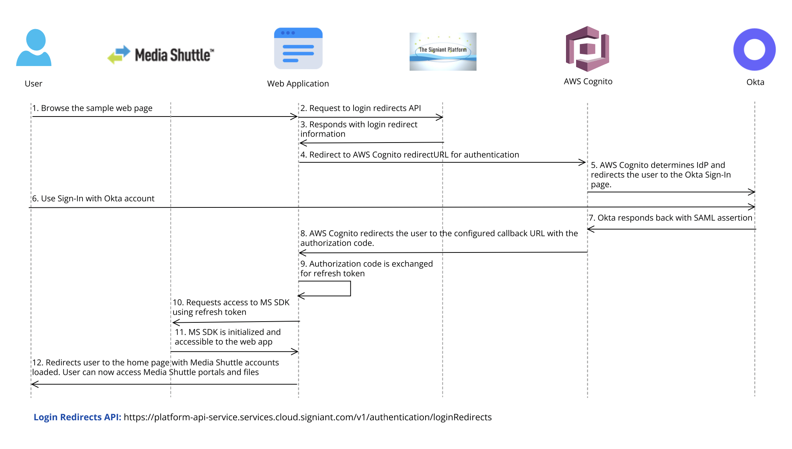

# SAML Integration with Media Shuttle SDK

This documentation specifies steps to integrate SAML with Media Shuttle SDK using [Okta Workforce Identity Cloud](https://www.okta.com) and [AWS Cognito User Pools](https://docs.aws.amazon.com/cognito/latest/developerguide/cognito-user-identity-pools.html).

## SAML Flow



## Prerequisites
- Sign up for [Okta Workforce Identity](https://www.okta.com/free-trial/workforce-identity/) account:
  - Ensure you have an Okta Workforce Identity account. If you don't have one, sign up for the Okta account by visiting their website and following the registration process.
- Create [Okta SAML app integration](https://help.okta.com/en-us/content/topics/apps/apps_app_integration_wizard_saml.htm).
  - Note - We will update the `Single sign on URL` and `Audience URI (SP Entity ID)` in the app once the configuration by the Signiant SRE is complete. Since they are mandatory to finalize the creation process and metadata URL (required by Signiant SRE) is available only after the app is created, provide test values for these. 
- Signiant SRE will need the metadata URL of your Okta SAML app to enable the Console SSO for your account and configure your Okta app as a client app in the AWS Cognito user pool.


## Configuration setup by Signiant SRE
  
### Requirements
Signiant SRE will need the following information to enable the Console SSO for your account.
- **Login Identifier**: Provide the SRE with the login identifier, preferably unique and specific to your domain, for example, `sample-yourAccountName` or `sample-yourDomain`. SRE will use this for your Okta app configuration on AWS Cognito.
- **Okta App Metadata URL**: On the Sign On tab of your Okta app, find the `Metadata URL`. Copy this URL and provide this URL to the SRE.
- **Callback URL**: Provide the SRE with the callback URL (for example `yourWebsiteURL/callback` or `yourWebsiteURL/authCallback`) or any similar intermediate route of your web application that will be responsible to receive the authorization code after authentication and initiate the process for exchanging refresh token. This URL will be added by the SRE as the allowed callback URL in the AWS Cognito Console.

### Configuration by SRE:
SRE will enable the `Console SSO` for your account using the above information via an automated tool used by them. The configuration setup also includes:
- Creating a user pool in the AWS Cognito.
- Set up your Okta client app integration in the above created user pool.
- Set up your allowed callback URL in the configured client app integration.

### Information to be provided by SRE:
- Once the user pool is created, check with the SRE to provide you with the following information:
  - `idpresponse` URL, for example, `https://yourDomainPrefix.auth.region.amazoncognito.com/saml2/idpresponse` to be configured as a `Single sign on URL` in your Okta SAML App.
  - `userPoolId` to be used in `Audience URI (SP Entity ID)` in your Okta SAML App.

## Configure Sign On information in the Okta SAML App
- Find the welcome email in your inbox that you received when you signed up. The email contains your Okta sign-in URL. 
- Use this sign-in URL to log in to your Okta account. 
- Go to your `Admin Dashboard`.
- Go to `Applications`.
- Click on your SAML app.
- Under `GENERAL`, for Single sign on URL, enter `idpresponse` URL provided by SRE.
- For `Audience URI (SP Entity ID)`, enter `urn:amazon:cognito:sp:yourUserPoolId`. Replace `yourUserPoolId` with the `userPoolId` provided by the SRE.
- Under `ATTRIBUTE STATEMENTS (OPTIONAL)`, add a statement with the following information:
  - For Name, enter the SAML attribute name `http://schemas.xmlsoap.org/ws/2005/05/identity/claims/emailaddress`.
  - For Value, enter `user.email`.
- [Assign a user](https://help.okta.com/en-us/content/topics/provisioning/lcm/lcm-assign-app-user.htm) to your Okta application.

## SAML Flow to be integrated inside your web application
The following steps demonstrate on how to initiate the cognito login flow inside your web application:
- Generate a code verifier and a code challenge required for authorization. You can use any online PKCE Generator Tool.
- Get the login redirect information via the `Signiant Platform API` - `https://platform-api-service.services.cloud.signiant.com/v1/authentication/loginRedirects`. 
  - Required parameters: `loginIdentifier`, `redirect_uri` (callback URL), `codeChallenge` (from above step).
  - Api provides `clientId`, `domain` and `redirectURL` which are required to exchange authorization code for refresh token.
- Redirect your web page to the `redirectURL` received from the response of `loginRedirects` api.
- The `redirect_uri` (callback URL) is invoked by Cognito with code request parameter, for example, `redirect_uri?code=testCode`.
  - Exchange an authorization code grant with PKCE for refresh_token by making a [REST call](https://docs.aws.amazon.com/cognito/latest/developerguide/token-endpoint.html) to the Cognito domain.
````
POST YOUR_COGNITO_DOMAIN_URL/oauth2/token&
    Content-Type='application/x-www-form-urlencoded'&    
    grant_type=authorization_code&
    client_id=CLIENT_ID&
    code=AUTHORIZATION_CODE&
    code_verifier=CODE_VERIFIER&
    redirect_uri=REDIRECT_URI

````
  - Use the refresh_token received in the response to initialize MS SDK library.
````
const loginCredentials = new RefreshingCredentials({
    refreshToken: REFRES_TOKEN,
    clientId: CLIENT_ID,
    domain: YOUR_COGNITO_DOMAIN_URL,
});
````